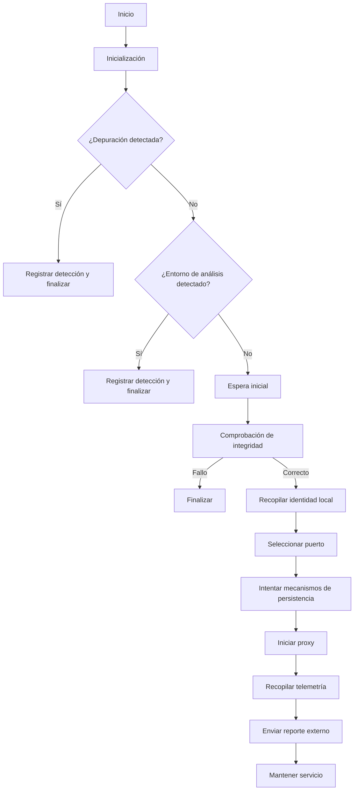
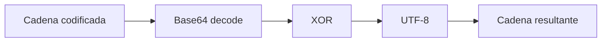
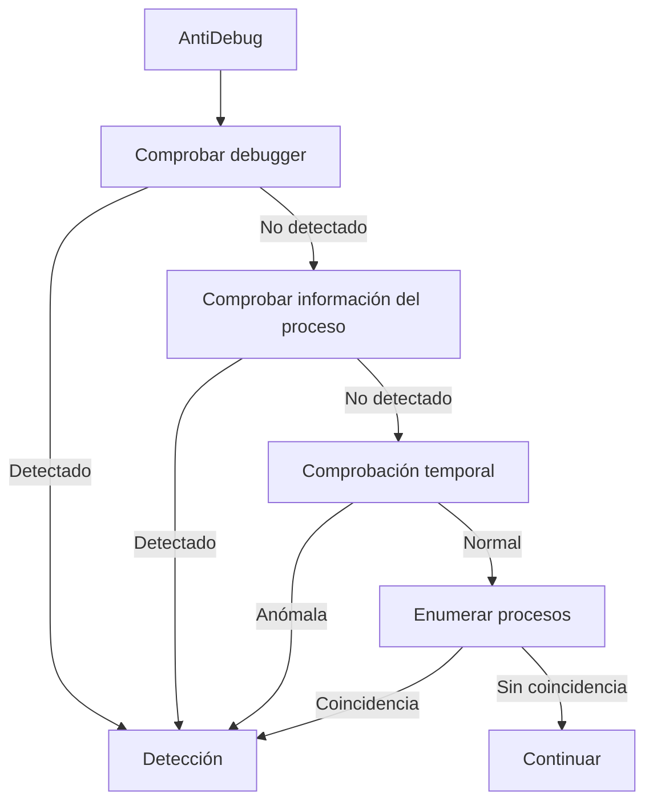
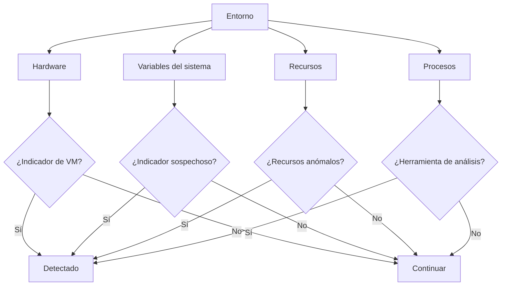
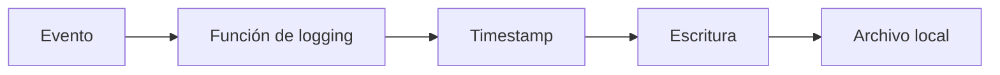
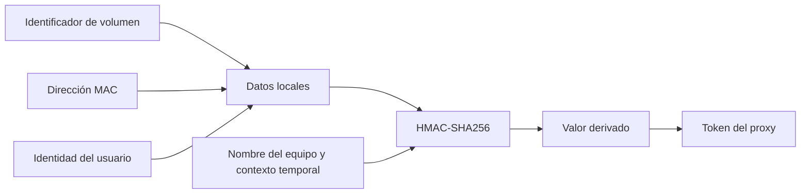
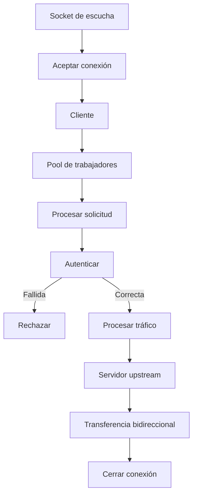
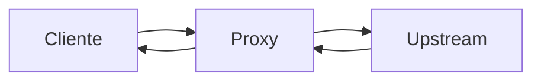
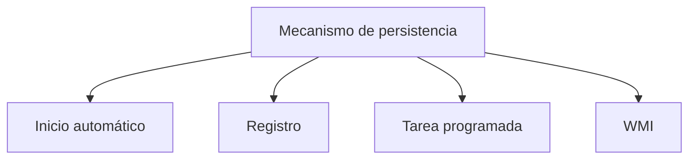
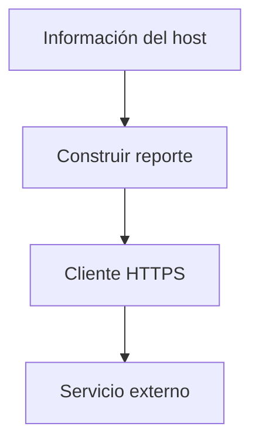

# ProxyBotnet v1.0 — Análisis técnico

> **Aviso de seguridad**
>
> Este documento describe el comportamiento observable del código analizado. El programa presenta características asociadas a software potencialmente no confiable, entre ellas evasión de análisis, persistencia en Windows, funcionamiento como proxy y recopilación de información del sistema.
>
> No debe ejecutarse ni desplegarse en equipos o redes sin autorización expresa.
>
> La referencia a nombres, organizaciones, marcas o autores presentes en el código no constituye evidencia de propiedad, afiliación, autorización ni responsabilidad.

## 1. Resumen

El código analizado es una aplicación Java orientada a Windows que combina varios componentes:

1. Ofuscación ligera de cadenas mediante Base64 y XOR.
2. Detección de depuración y herramientas de análisis.
3. Detección de posibles máquinas virtuales o sandboxes.
4. Comprobaciones temporales destinadas a dificultar el análisis automatizado.
5. Fingerprinting basado en identificadores locales del equipo.
6. Selección dinámica de un puerto TCP local.
7. Mecanismos de persistencia en Windows.
8. Servidor/proxy TCP con concurrencia limitada.
9. Autenticación mediante un token derivado localmente.
10. Soporte para túneles TCP y reenvío HTTP.
11. Obtención de información de red y del sistema.
12. Telemetría externa mediante Telegram cuando las credenciales correspondientes están configuradas.
13. Registro local de eventos.

No se observa en el código proporcionado una implementación explícita de robo de cookies, lectura de bases de datos de navegadores, captura de teclado, captura de pantalla o ransomware.

## 2. Flujo general



## 3. Ofuscación

La función `dec()` realiza una transformación sencilla:



Esta técnica debe considerarse ofuscación y no cifrado robusto.

## 4. Detección de depuración y análisis

El código utiliza varias comprobaciones para determinar si se está ejecutando bajo condiciones de análisis.

Entre ellas se encuentran:

* `IsDebuggerPresent`.
* Consulta de información del proceso/PEB.
* Comprobaciones temporales.
* Enumeración de procesos.
* Búsqueda de herramientas asociadas al análisis o depuración.



Este comportamiento constituye una característica de evasión de análisis.

## 5. Detección de VM y sandbox

La función correspondiente analiza características del entorno, incluyendo información de hardware, recursos, variables del sistema y procesos.

Entre las familias de indicadores observadas se encuentran:

* VMware.
* VirtualBox.
* QEMU.
* Xen.
* Parallels.
* Bochs.
* Otros indicadores de virtualización.

También se consideran factores como número de procesadores, memoria, almacenamiento, tiempo desde el arranque y cantidad de procesos.



## 6. Comportamiento ante detección

Cuando determinadas comprobaciones producen una detección, el programa registra el evento, introduce una espera y finaliza.

Este comportamiento reduce la utilidad de determinados entornos automatizados de análisis.

## 7. Registro local

El programa mantiene un archivo de registro bajo el perfil local del usuario.

Las escrituras están sincronizadas para evitar accesos concurrentes al archivo.



Los errores de escritura no parecen propagarse de forma significativa al flujo principal.

## 8. Integridad

La comprobación de integridad calcula un SHA-256 del ejecutable.

Sin embargo, el código no compara el resultado con un hash de referencia ni con una firma conocida. Por tanto, esta operación no permite determinar por sí sola si el archivo es auténtico.

## 9. Fingerprinting y autenticación

El programa recopila varios identificadores locales, entre ellos información del volumen, adaptadores de red e identidad del usuario.

A partir de estos datos genera un valor derivado mediante HMAC-SHA256 que posteriormente se utiliza para identificar/autenticar conexiones al proxy.



Este mecanismo constituye fingerprinting del sistema y vincula la autenticación con características locales del equipo.

## 10. Proxy

El componente de red abre un puerto TCP local y acepta conexiones entrantes.

Las conexiones se procesan mediante un pool de trabajadores con capacidad limitada.



El código soporta solicitudes `CONNECT` y reenvío de tráfico HTTP.

`Proxy-Authorization` es una cabecera HTTP estándar; lo específico del programa es el valor utilizado para la autenticación.

## 11. Transferencia de datos

El puente de comunicación utiliza dos direcciones independientes:



El contenido del flujo se transporta como bytes sin que el proxy necesite interpretar todo el tráfico.

## 12. Persistencia

El código contiene varios mecanismos de inicio automático en Windows.

Entre los indicadores documentados se encuentran:

* Copia del ejecutable en una ubicación de inicio.
* Entrada de registro `Run`.
* Tarea programada.
* Suscripciones WMI persistentes.



La combinación de varias técnicas aumenta significativamente el riesgo durante una evaluación de seguridad.

## 13. Telemetría externa

El componente de telemetría recopila información del host, incluyendo:

* IP pública.
* IP local.
* Nombre del equipo.
* Usuario.
* Estado de privilegios.
* Uptime.
* Puerto del proxy.
* Token derivado.

El mensaje se identifica como `ProxyBotnet v1.0` y puede enviarse a Telegram cuando las credenciales correspondientes están configuradas.



En la copia analizada, las credenciales de Telegram están vacías, por lo que esta función no está configurada funcionalmente.

## 14. Información de red

El código consulta servicios externos para determinar la IP pública y enumera las interfaces locales para obtener información de red.

La dependencia de servicios externos debe considerarse un indicador adicional durante una investigación.

## 15. Qué no se observa

A partir del código disponible, no se observa:

* Lectura de bases de datos de Chrome, Edge o Firefox.
* Extracción directa de cookies.
* Lectura directa de contraseñas guardadas.
* Captura de pulsaciones.
* Captura de pantalla.
* Grabación de audio.
* Cifrado de archivos de usuario.
* Implementación visible de ransomware.
* Descarga explícita de una segunda carga.
* Canal de comandos remotos recibido desde Telegram.

La ausencia de estas funciones en el código revisado no implica que el programa sea seguro.

## 16. Indicadores observables

| Categoría          | Indicador                                                                |
| ------------------ | ------------------------------------------------------------------------ |
| Archivo            | `%LOCALAPPDATA%\svchost.dat`                                             |
| Startup            | `...\Start Menu\Programs,Startup\svchost.exe`                            |
| Registro           | `HKCU\Software\Microsoft\Windows\CurrentVersion\Run`                     |
| Valor Run          | `SvcHost32`                                                              |
| Tarea programada   | `SvcHost32`                                                              |
| WMI                | `__EventFilter`, `CommandLineEventConsumer`, `__FilterToConsumerBinding` |
| Procesos/comandos  | `tasklist`, `wmic`, `whoami`, `net session`, `reg`, `schtasks`, `attrib` |
| Red                | Puerto TCP seleccionado dinámicamente                                    |
| HTTP               | `Proxy-Authorization`                                                    |
| Servicios externos | `api.ipify.org`, `icanhazip.com`, `ifconfig.me/ip`                       |
| Telegram           | `api.telegram.org`                                                       |

## 17. Riesgo por componente

| Componente      |     Riesgo | Motivo                                                  |
| --------------- | ---------: | ------------------------------------------------------- |
| Ofuscación      |      Medio | Dificulta el análisis estático superficial              |
| Anti-debug      |       Alto | Detecta entornos de análisis                            |
| Anti-VM/sandbox |       Alto | Identifica posibles entornos automatizados              |
| Persistencia    |       Alto | Utiliza múltiples mecanismos de inicio automático       |
| Proxy           |       Alto | Permite reenviar tráfico de red                         |
| Telemetría      |       Alto | Puede enviar información del host a un servicio externo |
| Fingerprinting  | Medio/alto | Combina múltiples identificadores locales               |
| Integridad      |       Bajo | No utiliza un hash esperado                             |
| Logging         |      Medio | Conserva actividad localmente                           |

## 18. Dependencias

El código depende, como mínimo, de:

* Java/JDK compatible con las APIs utilizadas.
* JNA.
* JNA Platform.
* `org.json`.

También utiliza APIs y componentes específicos de Windows.

## 19. Conclusión

El programa analizado no corresponde a un comprobador de cookies.

Su comportamiento combina:

```text
             EJECUCIÓN
                 |
      +----------+----------+
      |          |          |
    Evasión  Persistencia Fingerprint
      |          |          |
      +----------+----------+
                 |
              Proxy
                 |
        +--------+--------+
        |                 |
     TCP/HTTP         Telemetría
                          |
                       Externo
```

Los aspectos de mayor relevancia para una revisión defensiva son la evasión de análisis, la persistencia múltiple, el fingerprinting del host, la capacidad de actuar como proxy y la posibilidad de enviar telemetría a un servicio externo.

Este documento describe únicamente el comportamiento observado en el código proporcionado. No constituye una validación de seguridad, legitimidad, autoría o autorización.

## 20. Referencias del código analizado

Las referencias de líneas corresponden al código fuente analizado y no a este README:

* Inicialización y flujo principal: 16–116.
* Ofuscación: 30–37.
* Anti-debugging: 129–162.
* Anti-VM/sandbox: 164–230.
* WMI auxiliar: 233–264.
* Fingerprinting/token: 267–305.
* Selección de puerto: 309–312.
* Persistencia: 314–356.
* Proxy: 368–469.
* Telemetría: 472–510.
* Privilegios: 516–522.
* IP pública/local: 524–553.
* Integridad: 555–563.
