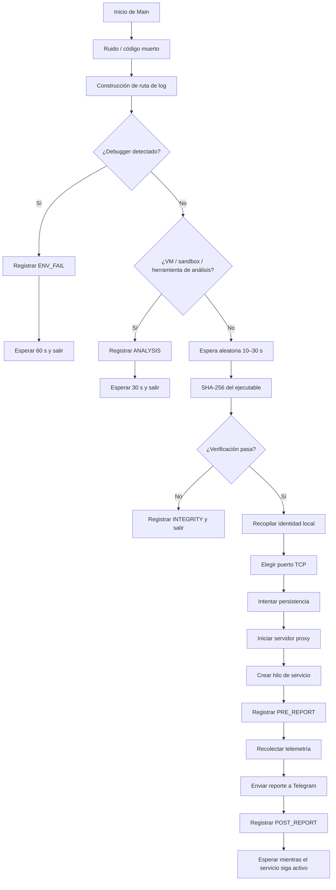
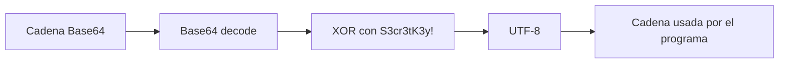
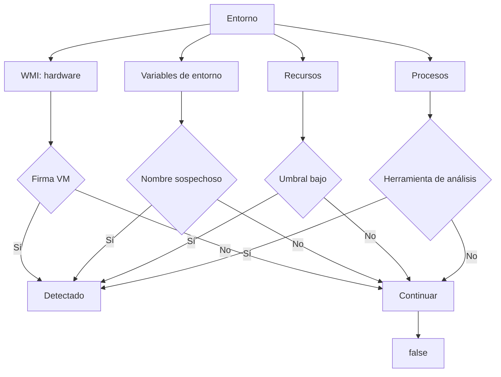
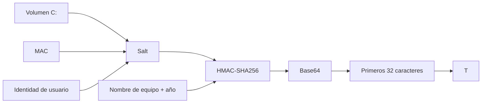
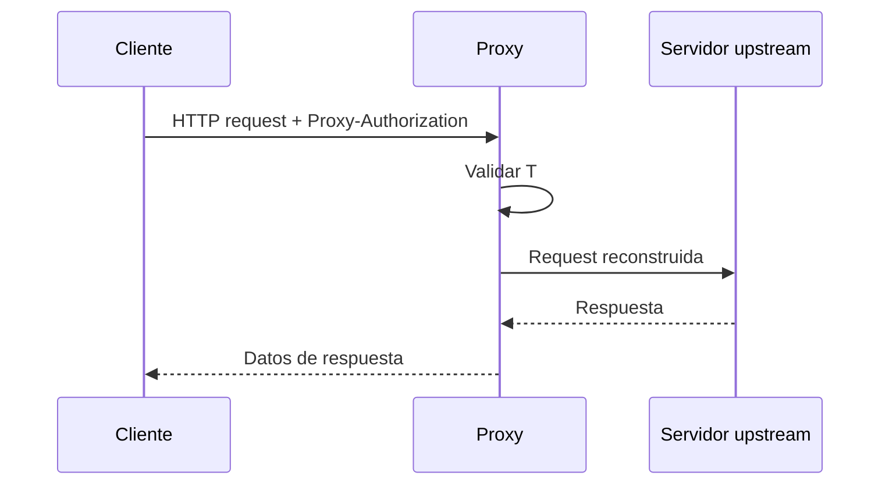
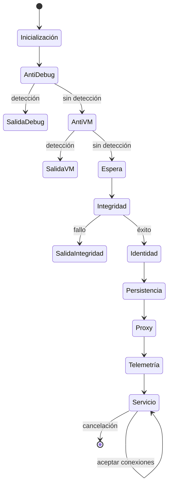

# ProxyBotnet v1.0 | M-Society Root Access Ethical Hacking

> **Aviso de seguridad y atribución**
>
> Este documento describe el comportamiento observable del código proporcionado. El programa contiene mecanismos de evasión de análisis, persistencia en Windows, un proxy TCP/HTTP autenticado y envío de telemetría a Telegram. Por ello debe tratarse como **software potencialmente no confiable** y no ejecutarse en equipos o redes que no estén expresamente autorizados.
>
> **M-Society no debe interpretarse como responsable, autorizadora ni garante de ningún uso del código.** La referencia a una firma, organización, marca o autor en el código o en este documento no constituye evidencia de propiedad, afiliación, autorización o responsabilidad. El uso, modificación, distribución o despliegue de este código corresponde exclusivamente a quien lo realice y debe cumplir las leyes, políticas y autorizaciones aplicables.

## 1. Resumen

El archivo contiene una aplicación Java para Windows que combina varias funciones:

1. Ofuscación ligera de cadenas mediante Base64 + XOR.
2. Detección de depuradores y herramientas de análisis.
3. Detección de posibles máquinas virtuales/sandboxes.
4. Esperas y comprobaciones destinadas a dificultar el análisis automatizado.
5. Cálculo de una huella derivada de identificadores locales.
6. Elección de un puerto TCP local.
7. Copia del ejecutable a una ruta de inicio automático.
8. Persistencia adicional mediante `Run`, una tarea programada y WMI, cuando la comprobación de privilegios lo permite.
9. Inicio de un servidor/proxy TCP con un máximo de 50 trabajadores concurrentes.
10. Autenticación del proxy mediante una cabecera personalizada y un token calculado localmente.
11. Soporte para `CONNECT` y para solicitudes HTTP con reenvío hacia un servidor upstream.
12. Consulta de IP pública e IP local.
13. Recolección de nombre de equipo, usuario, puerto, token, uptime y estado de privilegios.
14. Envío de esa información a la API de Telegram si se configuran `TOKEN` y `CHAT_ID`.
15. Registro local de eventos en un archivo dentro de `%LOCALAPPDATA%`.

## 2. Flujo general



## 3. Componentes principales

### 3.1. Variables globales

El programa define:

* `Semaphore S = new Semaphore(50)`: se declara un semáforo con capacidad 50, aunque en el código mostrado no se utiliza posteriormente.
* `Object L`: monitor para serializar escrituras del log.
* `F`: ruta del archivo de log.
* `P`: puerto TCP elegido dinámicamente.
* `T`: token calculado para autenticar clientes del proxy.
* `Cts`: objeto de cancelación del servicio.
* `XOR_KEY`: clave fija utilizada para descifrar cadenas.
* `TOKEN` y `CHAT_ID`: credenciales de Telegram, vacías en la versión proporcionada.

Referencia: líneas 16–28.

### 3.2. Ofuscación de cadenas

La función `dec()`:

1. Decodifica una cadena Base64.
2. Aplica XOR byte a byte con la clave `S3cr3tK3y!`.
3. Convierte el resultado a UTF-8.
4. Si falla, devuelve la cadena original.



Esto es **ofuscación**, no cifrado robusto. Su objetivo observable es evitar que muchas cadenas importantes aparezcan directamente en el código compilado/fuente.

Referencia: líneas 30–37.

## 4. Detección de depuración y análisis

La función `a()` implementa varias comprobaciones.

### 4.1. API `IsDebuggerPresent`

Usa JNA para llamar a `kernel32!IsDebuggerPresent()`.

Si devuelve verdadero, el programa considera que está siendo depurado.

### 4.2. Consulta del PEB

También usa `NtQueryInformationProcess()` desde `ntdll` y accede al PEB para comprobar indicadores relacionados con depuración.

### 4.3. Comprobación temporal

Ejecuta un bucle de 2.000.000 de iteraciones y mide su duración mediante `GetTickCount()`.

Si la ejecución tarda más de 800 ms, devuelve una detección positiva.

Esto funciona como una comprobación temporal simple que puede verse afectada por depuración, instrumentación o un entorno especialmente lento.

### 4.4. Búsqueda de procesos conocidos

Ejecuta `tasklist` y busca nombres asociados con herramientas de depuración/análisis, entre ellos:

* x64dbg
* x32dbg
* OllyDbg
* IDA
* IDA64
* Cheat Engine
* dnSpy
* ILSpy
* de4dot
* Process Hacker

Los valores están ofuscados mediante `dec()`.

```mermaid
flowchart TD
    A[a()] --> B[IsDebuggerPresent]
    B -->|detectado| X[true]
    B -->|no detectado| C[Consultar PEB]
    C -->|detectado| X
    C -->|no detectado| D[Medir bucle temporal]
    D -->|> 800 ms| X
    D -->|normal| E[Ejecutar tasklist]
    E --> F[Comparar nombres]
    F -->|coincidencia| X
    F -->|sin coincidencia| G[false]
```

Referencias: líneas 129–162.

## 5. Detección de máquinas virtuales y sandboxes

La función `b()` intenta determinar si el entorno parece automatizado o virtualizado.

Consulta mediante WMI:

* fabricante del equipo;
* nombre del procesador;
* número de serie de BIOS;
* modelo;
* GPU/controlador de vídeo.

Compara esos datos con firmas como:

* VMware
* VirtualBox
* Vbox
* QEMU
* Xen
* Oracle
* Virtual
* Parallels
* Bochs
* Innotek
* Red Hat
* Amazon EC2

También inspecciona:

* nombre de equipo;
* nombre de usuario;
* número de procesadores;
* RAM física;
* tamaño del disco;
* tiempo desde el arranque del sistema;
* cantidad de elementos recientes;
* número total de procesos;
* procesos de herramientas como Wireshark, Fiddler, Charles, Process Monitor, RegMon y FileMon.

Hay umbrales que producen una detección positiva, por ejemplo:

* menos de 2 procesadores;
* menos de 2 GiB de RAM;
* disco menor de 60 GiB;
* tiempo del sistema inferior a 2 minutos;
* pocos elementos recientes;
* menos de 15 procesos.



Referencias: líneas 164–230.

## 6. Comportamiento ante detección

En `main()`:

* si `a()` detecta depuración, escribe `ENV_FAIL`, espera 60 segundos y termina;
* si `b()` detecta análisis/virtualización, escribe `ANALYSIS`, espera 30 segundos y termina.

Este comportamiento constituye una forma de **evasión de análisis**.

Referencias: líneas 81–90.

## 7. Registro local

La función `l()` escribe entradas con timestamp en el archivo `F`.

La ruta se construye usando la variable de entorno `%LOCALAPPDATA%` y el nombre ofuscado `svchost.dat`.

El acceso al archivo está protegido por `synchronized (L)`.

El código ignora errores de escritura.

```mermaid
flowchart LR
    A[Evento] --> B[l(msg)]
    B --> C[Timestamp UTC]
    C --> D[Append]
    D --> E[%LOCALAPPDATA%\\svchost.dat]
```

Referencias: líneas 79 y 119–126.

## 8. Comprobación de integridad

La función `c()`:

1. obtiene la ruta del ejecutable actual;
2. lee el archivo completo;
3. calcula SHA-256;
4. comprueba que el resultado tenga 32 bytes;
5. además exige que el primer byte sea distinto de cero.

No existe una comparación contra un hash esperado o una firma conocida.

Por tanto, esta comprobación **no demuestra que el archivo sea auténtico**. Solo verifica una condición débil sobre el resultado del hash.

Referencias: líneas 555–563.

## 9. Identidad local y token del proxy

La función `i()` recopila:

* número de serie del volumen C:;
* primera dirección MAC activa/no-loopback;
* información del usuario obtenida mediante `whoami`.

Después concatena esos valores:

```text
volumeSerial|macAddress|userSid
```

y utiliza HMAC-SHA256 para generar un valor derivado de:

```text
checker_api_ + COMPUTERNAME + año actual
```

El resultado Base64 se recorta a 32 caracteres y se almacena en `T`.

Ese valor se utiliza después como secreto de autenticación del proxy.



Referencias: líneas 267–305.

## 10. Elección del puerto

La función `n()` abre temporalmente un `ServerSocket` con puerto `0`, dejando que el sistema operativo seleccione un puerto libre.

El número elegido se guarda en `P`.

Si la operación falla, se selecciona aleatoriamente un puerto del rango 49152–65535.

Referencia: líneas 309–312.

## 11. Persistencia en Windows

La función `j()` intenta establecer varias formas de inicio automático.

### 11.1. Copia del ejecutable

Construye una ruta bajo:

```text
%APPDATA%\Microsoft\Windows\Start Menu\Programs,Startup\svchost.exe
```

y copia allí el ejecutable actual si no existe o su tamaño difiere.

Después utiliza `attrib` para modificar atributos del archivo.

### 11.2. Clave `Run`

Ejecuta `reg add` para crear una entrada en:

```text
HKCU\Software\Microsoft\Windows\CurrentVersion\Run
```

con el nombre `SvcHost32`.

### 11.3. Tarea programada

Si `o()` devuelve verdadero, ejecuta `schtasks /create` para crear una tarea llamada `SvcHost32`.

La tarea se configura para ejecutarse al iniciar sesión y con nivel elevado.

### 11.4. WMI Event Subscription

También intenta crear una suscripción WMI permanente mediante:

* `__EventFilter`;
* `CommandLineEventConsumer`;
* `__FilterToConsumerBinding`.

La lógica crea un filtro que reacciona a determinados eventos de modificación de rendimiento y ejecuta el binario.

```mermaid
flowchart TD
    A[j()] --> B[Copia a Startup]
    A --> C[HKCU Run]
    A --> D{¿o() indica privilegios?}
    D -->|Sí| E[Tarea programada]
    D -->|Sí| F[WMI Event Subscription]
    D -->|No| G[Omitir E/F]
    B --> H[Contar éxito]
    C --> H
    E --> H
    F --> H
    G --> H
    H --> I[Registrar PERSIST: n/4]
```

La presencia de varias técnicas de persistencia es uno de los aspectos de mayor riesgo del programa.

Referencias: líneas 314–356.

## 12. Comprobación de privilegios

La función `o()` ejecuta:

```text
net session
```

y considera que el comando tuvo éxito como indicación de privilegios administrativos.

Referencia: líneas 516–522.

## 13. Servidor/proxy

La función `k()`:

1. abre un `ServerSocket` en `P`;
2. registra el puerto;
3. acepta conexiones;
4. crea un trabajo para cada cliente;
5. procesa cada conexión mediante `p()`;
6. usa un `ExecutorService` con 50 hilos;
7. permanece activo hasta recibir cancelación.

```mermaid
flowchart TD
    A[ServerSocket P] --> B[accept()]
    B --> C[Cliente]
    C --> D[pool de hasta 50 hilos]
    D --> E[p(client)]
    E --> F[Autenticación]
    F -->|fallo| G[HTTP 407]
    F -->|OK| H[Procesar solicitud]
    H --> I[Conectar upstream]
    I --> J[Transferencia bidireccional]
    J --> K[Cerrar conexión]
    K --> B
```

Referencias: líneas 368–390.

## 14. Autenticación del proxy

La función `p()` espera una cabecera HTTP personalizada equivalente a:

```text
Proxy-Authorization
```

y comprueba que su valor contenga `T`.

Si falta o no coincide, devuelve:

```text
HTTP/1.1 407 Proxy Authentication Required
```

El programa no implementa aquí un sistema completo de usuarios, sesiones, expiración o rotación de credenciales.

Referencias: líneas 393–410.

## 15. Método `CONNECT`

Cuando el método es `CONNECT`:

1. divide el destino en host y puerto;
2. usa 443 como puerto predeterminado;
3. crea un socket TCP hacia el destino;
4. devuelve `200 Connection Established`;
5. inicia transferencia bidireccional entre cliente y upstream.

Esto permite establecer un túnel TCP a través del proceso.

Referencias: líneas 417–424.

## 16. Reenvío HTTP

Para otros métodos:

1. convierte el destino en `URI`;
2. obtiene host, puerto, ruta y query;
3. abre una conexión al upstream;
4. reconstruye la primera línea HTTP;
5. reenvía las cabeceras excepto `Proxy-Authorization`;
6. inicia el puente de datos.



Referencias: líneas 425–443.

## 17. Transferencia de datos

La función `t()` crea dos hilos:

* cliente → upstream;
* upstream → cliente.

Cada dirección utiliza `u()` con un buffer de 16 KiB.

Esto implementa un puente bidireccional de bytes sin interpretar el contenido del flujo.

Referencias: líneas 453–469.

## 18. Telemetría y reporte externo

La función `m()` obtiene:

* IP pública;
* IP local;
* nombre de equipo;
* usuario;
* estado de privilegios;
* uptime;
* puerto del proxy;
* token `T`.

Construye un mensaje identificado como:

```text
ProxyBotnet
```

y lo envía mediante `sendTelegram()`.

`sendTelegram()` hace un POST HTTPS a la API de Telegram utilizando `TOKEN` y `CHAT_ID`.

En el archivo proporcionado ambos valores están vacíos, por lo que el envío no está configurado funcionalmente en esta copia.

```mermaid
flowchart TD
    A[m()] --> B[IP pública]
    A --> C[IP local]
    A --> D[Hostname]
    A --> E[Usuario]
    A --> F[Admin]
    A --> G[Uptime]
    A --> H[Puerto]
    A --> I[Token T]
    B --> J[Construir mensaje]
    C --> J
    D --> J
    E --> J
    F --> J
    G --> J
    H --> J
    I --> J
    J --> K[sendTelegram()]
    K --> L[HTTPS POST]
    L --> M[api.telegram.org]
```

Referencias: líneas 472–510.

## 19. Obtención de IP pública

La función `v()` prueba sucesivamente tres servicios externos:

* `api.ipify.org`
* `icanhazip.com`
* `ifconfig.me/ip`

Devuelve la primera respuesta HTTP 200 que pueda leer.

Si todos fallan, devuelve `0.0.0.0`.

Referencia: líneas 524–540.

## 20. Obtención de IP local

La función `w()` enumera interfaces de red activas y no loopback y devuelve la primera dirección IPv4 encontrada.

Si no encuentra ninguna, devuelve `127.0.0.1`.

Referencia: líneas 542–553.

## 21. Máquina de estados simplificada



## 22. Qué NO hace el código mostrado

A partir del contenido disponible, no se observa:

* lectura de bases de datos de Chrome/Edge/Firefox;
* extracción de cookies;
* lectura directa de contraseñas guardadas;
* captura de pulsaciones de teclado;
* captura de pantalla;
* grabación de audio;
* implementación de ransomware;
* cifrado de archivos de usuario;
* descarga de una segunda carga desde Internet;
* un mecanismo explícito de comandos remotos recibido desde Telegram.

Esto no elimina el riesgo del programa: la combinación de evasión, persistencia, proxy y telemetría ya constituye una superficie de abuso importante.

## 23. Indicadores observables

Los siguientes elementos pueden servir como indicadores durante una revisión defensiva:

| Categoría        | Indicador                                                                |
| ---------------- | ------------------------------------------------------------------------ |
| Archivo          | `%LOCALAPPDATA%\svchost.dat`                                             |
| Startup          | `...\Start Menu\Programs,Startup\svchost.exe`                            |
| Registro         | `HKCU\Software\Microsoft\Windows\CurrentVersion\Run`                     |
| Valor Run        | `SvcHost32`                                                              |
| Tarea programada | `SvcHost32`                                                              |
| WMI              | `__EventFilter`, `CommandLineEventConsumer`, `__FilterToConsumerBinding` |
| Proceso          | `tasklist`, `wmic`, `whoami`, `net session`, `reg`, `schtasks`, `attrib` |
| Red              | Puerto TCP elegido dinámicamente                                         |
| HTTP             | Cabecera `Proxy-Authorization`                                           |
| Externo          | `api.ipify.org`, `icanhazip.com`, `ifconfig.me/ip`                       |
| Telegram         | `api.telegram.org/bot.../sendMessage`                                    |

## 24. Riesgo por componente

| Componente            | Riesgo observado | Motivo                                              |
| --------------------- | ---------------: | --------------------------------------------------- |
| Ofuscación Base64/XOR |            Medio | Dificulta análisis estático superficial             |
| Anti-debug            |             Alto | Detecta y evita entornos de análisis                |
| Anti-VM/sandbox       |             Alto | Intenta impedir ejecución en entornos de inspección |
| Persistencia          |             Alto | Varias técnicas de inicio automático                |
| Proxy                 |             Alto | Permite reenviar tráfico TCP/HTTP                   |
| Telemetría            |             Alto | Envía información del host a un servicio externo    |
| Fingerprinting        |       Medio/alto | Combina varios identificadores del equipo           |
| Integridad            |             Bajo | No existe un hash esperado contra el que comparar   |
| Logging local         |            Medio | Conserva actividad y errores en disco               |

## 25. Dependencias

El código requiere, al menos:

* Java/JDK compatible con las APIs utilizadas;
* JNA;
* JNA Platform;
* `org.json`.

También depende de APIs y comandos específicos de Windows, entre ellos `kernel32`, `ntdll`, WMI, `tasklist`, `wmic`, `whoami`, `reg`, `schtasks`, `attrib` y `net`.

## 26. Conclusión

El programa no es simplemente un cliente HTTP ni un comprobador de cookies. Su comportamiento combina:

```text
          ┌───────────────────────┐
          │      EJECUCIÓN        │
          └───────────┬───────────┘
                      │
        ┌─────────────┼─────────────┐
        ▼             ▼             ▼
   Evasión         Persistencia   Fingerprint
        │             │             │
        └─────────────┼─────────────┘
                      ▼
                Servicio proxy
                      │
             ┌────────┴────────┐
             ▼                 ▼
        Tráfico TCP/HTTP    Telemetría
                                │
                                ▼
                         Telegram HTTPS
```

Desde una perspectiva de seguridad, los rasgos más significativos son la evasión de análisis, las múltiples técnicas de persistencia y la capacidad de actuar como proxy autenticado. El envío a Telegram añade una vía de comunicación externa para la información de identificación del host.

Este README documenta el comportamiento del código recibido; no constituye una validación de seguridad, legitimidad, autoría ni autorización de uso.

## 27. Referencia de líneas del código analizado

Las principales áreas documentadas corresponden a:

* Inicialización y flujo principal: 16–116.
* Ofuscación: 30–37.
* Anti-debugging: 129–162.
* Anti-VM/sandbox: 164–230.
* WMI auxiliar: 233–264.
* Fingerprinting/token: 267–305.
* Puerto: 309–312.
* Persistencia: 314–356.
* Proxy: 368–469.
* Telegram: 472–510.
* Privilegios: 516–522.
* IP pública/local: 524–553.
* Integridad: 555–563.
